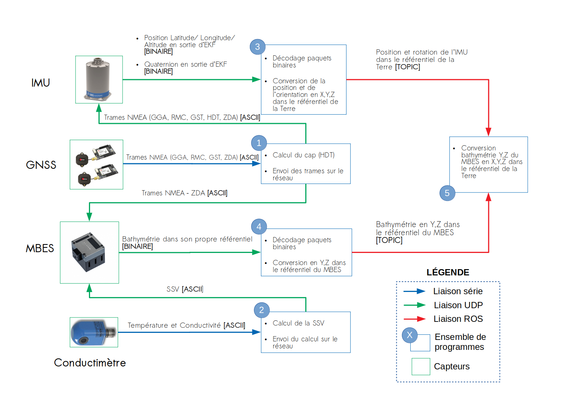

Ulysse Workspace
===

Ce dossier consitue le `workspace` ROS utilisé dans Ulysse.
Il permet la réalisation et le contrôle en temps réel de MNT.
Voir le package [ulysse_starter](src/ulysse_starter/README.md) pour le lancement des différentes briques nécessaires.

Trois principales fonctionnalités sont implémentées.

#### 1. Chaine d'acquisition

* **1.** Package ROS:
	*  [ublox_gps](src/ublox_gps/README.md)
	
* **2.** Package ROS:
	*  [ssv_computing](src/ssv_computing/README.md)

* **3.** Package ROS:
	* Décodage binaire: [sbg_ros_driver](src/sbg_ros_driver/README.md)
	* Adpatation des messages:  [ulysse_tf/src/TF_sbg](src/ulysse_tf/README.md)
	* Projection UTM: [geonav_transform](src/geonav_transform/README.md)

* **4.** Package ROS:
	* [mbes](src/mbes/README.md)

* **5.** Package ROS:
	* Soit visuellement via `RVIZ` et enregistrement via `rosbag`
	* Soit dans fichiers via package ROS: [mnt](src/mnt/README.md)
	
#### 2. Controle qualité

Le contrôle qualité en temps réel est effecuté via plusieurs filtres et d'un superviseur. Voir [quality_control](src/quality_control/README.md).
Le MNT issu est disponible, sous forme d'un fichier par fauchée, dans le dossier **LOGS** du package.

#### 3. Navigation et retour sur zone

Ulysse est doté d'un autopilot utilisant le protocol MAVLink, l'utilisation de MAVROS permet d'intéragir via ROS sur la navigation. Le package ayant ce rôle est: [ulysse_navigation](src/ulysse_navigation/README.md).

