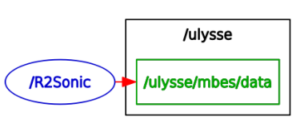

R2Sonic 2020 Package
====

Package ROS permettant de publier un message `PointCloud` contenant les coordonnées des points acquis lors d'un ping par le multifaisceaux. La déviation due à un profil de célérité est appliquée à chacun des points.

Architecture de dossiers
---

	mbes
	├── LOGS
	│   └── R2SONIC
	├── RESOURCES
	│   └── SVP
	└── src
	    ├── MBES.py
	    ├── mbes_to_ros_from_file.py
	    ├── mbes_to_ros_from_socket.py
	    └── SVP.py

* **LOGS/**: Fichiers log 
	* **R2SONIC/**: Fichiers log contenant les données brutes (binaire) du multifaisceau
* **RESOURCES/**: 
	* **SVP/**: Dossier contenant le profil de célérité à appliquer (SVP), voir un des fichiers pour la norme à respecter.
* **src/**:
	* `MBES.py`: script permettant de récupérer les packets binaires du R2SONIC 2020 et de renvoyer la liste des angles et temps aller-retour associés. 
	* `mbes_to_ros_from_file.py`: script appelant les fonctions de `MBES.py` à partir d'un fichier log. Transforme l'information en message ROS `PointCloud`.
	* `mbes_to_ros_from_socket.py`: script appelant les fonctions de `MBES.py` en temps réel et génère les fichiers log. Transforme l'information en message ROS `PointCloud`.
	* `SVP.py`: script contenant une fonction permettant de normaliser un fichier SVP ainsi qu'un fonction permettant d'appliquer le SVP au angles et temps issus de `MBES.py`et renvoyant les coordonnées 2D dans le repère du multifaisceau.

Node ROS
----

Le node ROS du package se lance via `rosrun`:

	rosrun mbes mbes_to_ros_from_socket.py

ou

	rosrun mbes mbes_to_ros_from_file.py

Dans les deux cas le node lancé est:

`R2Sonic` qui publie dans le topic `/ulysse/mbes/data` la bathymétrie dans un message `PointCloud`.

