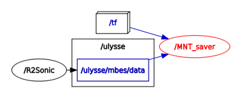
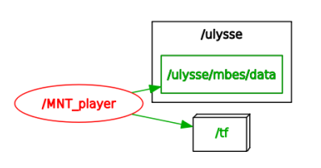

MNT Package
====

Package ROS permettant d'enregistrer un MNT lorsque que toute la chaine d'acquisition est mise en place.

Architecture de dossiers
---

	mnt
	├── LOGS
	│   └── XYZ
	└── src
	    ├── xyz_player.py
	    └── xyz_saver.py

* **LOGS/**: Fichiers log 
	* **XYZ/**: Fichiers contenant la MNT issue du script `xyz_saver.py`.
* **src/**:
	* `xyz_player.py`: Permet d'afficher le MNT dans RVIZ
	* `xyz_saver.py`: Permet d'enregistrer un MNT lorsque toute la chaine d'aquisition est en place.

Nodes ROS
----

* **MNT_saver**:

Se lance avec `rosrun`:

	$ rosrun mnt xyz_saver.py

Lance le node `MNT_saver` qui est aboné au topic `/tf`et au topic `/ulysse/mbes/data`.

* **MNT_player**:

Se lance avec `rosrun`:

	$ rosrun mnt xyz_player.py

Lance le node `MNT_player` qui publie le topic `/tf`et le topic `/ulysse/mbes/data`.

