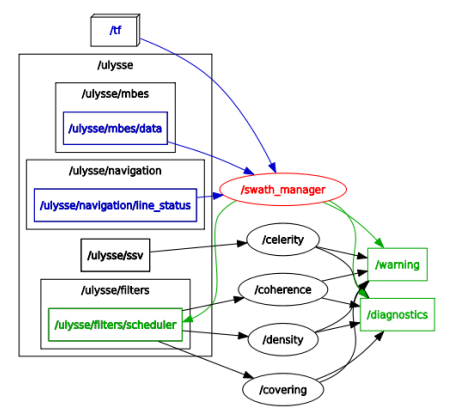

Quality Control Package
====

Package ROS permettant le controle qualité des acquisitions en temps réel. Les filtres génèrent des `warnings` pris en compte par le controleur lors d'anomalies détectée, afin d'effectuer un retour sur zone en fin de fauchée.

Architecture de dossiers
---

	mnt
	├── LOGS
	│   └── XYZ_lines
	└── src
	    ├── filters
	    │   ├── celerite.py
	    │   ├── coherence.py
	    │   ├── densite.py
	    │   └── recouvrement.py
	    └── manager
			├── line_manager.py
			└── outliers.py

* **LOGS/**: Fichiers log 
	* **XYZ_lines/**: Fichier contenant les fauchées validées et invalidées, utilisées par les filtres.
* **src/**:
	* **filters/**:
		* `celerity.py`: Compare la SSV au SVP.
		* `coherence.py`: Analyse la cohérence des fauchées
		* `density.py`: Analyses la densité des sondes
		* `recouvrement.py`: Analyse le recouvrement des fauchées
	* **manager/**:
		* `line_manager.py`: Récupère les sondes brutes et génère les fauchées qui seront analysées par les filtres
		* `outliers.py`: Analyse les outiliers dans les données brutes afin de valider ou non une fauchées.

Nodes ROS
----

