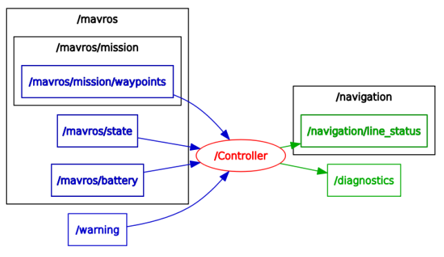

Controller package
====

Package ROS permettant de gérer la navigation d'Ulysse via MAVROS.

Architecture de dossiers
---

	ulysse_navigation
	└── src
	    └── controller.py

* **src/**:
	* `controller.py`: Script gérant la navigation.

Node ROS
---

Nécessite de lancer `mavros` en amont:

Se lance avec `rosrun`:

	$ rosrun ulysse_navigation controller.py

## Topics et services utilisés :

### Subscribers :

* `/mavros/state` : état courant d'Ulysse (armed, mode, guided...)
* `/mavros/battery` : état de la batterie
* `/mavros/mission/waypoints` : liste des waypoints de la mission, waypoint courant.
* `/warning` : alerte sur une mauvaise mesure

### Publishers :
* `/Diagnostics` : publication de l'état du drone sur le topics de diagnostics
* `/navigation/line_status`: publication du type de ligne (traversière ou régulière) à chaque début de ligne.

### Services :
* `/mavros/mission/set_current` : service utilisé pour la publication du wpt du correction
* `/mavros/set_mode` : service utilisé pour la publication de la mise en mode stationnaire
