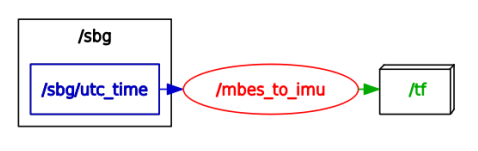
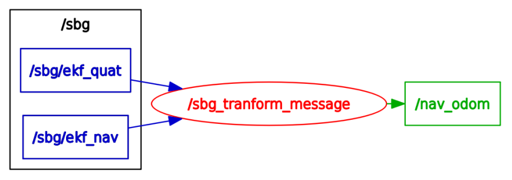
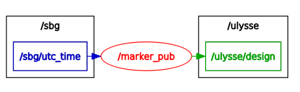

TF Package
====

Package ROS permettant de publier les TF entre le _mbes_, l'_imu_ et l'_odom_. Permet également l'affichage d'un marker Ulysse dans _rviz_.

Architecture de dossiers
---

	ulysse_tf
	├── doc
	│   └── geonav_transform_doc.pdf
	├── launch
	│   ├── sbg_geonav_transform.launch
	│   └── sbg_geonav_transform_TEST.launch
	├── mesh
	│   └── ulysse.obj
	└── src
	    ├── TF_mbes
	    │   └── tf_mbes.py
	    ├── TF_sbg
	    │   ├── sbg_to_odom.py
	    │   └── TEST_sbg_to_odom.py
	    └── Ulysse_marker
			└── boat_simulator.py

* **doc/**: Documentation
	* `geonav_transform_doc.pdf`: PDF issu de la documentation du package **geonav_transform**.
* **launch/**: 
	* `sbg_geonav_transform.launch`: Lance le package `geonav_transform` qui permet de convertir une position Latitude/Longitude/Altitude d'un message `Odometry` en TF X/Y/Z ayant un point fixe définit comme référence `datum`. Lance également le node `sbg_to_odom` permettant de générer le message `Odometry` à partir des topics renvoyés par le node `sbg_driver`.
	* `sbg_geonav_transform_TEST.launch`: Idem mais utilisé pour rejouer des _rosbag_.
* **mesh/**: Marker pour Ulysse
	* `ulysse.obj`: fichier permettant d'afficher Ulysse dans un Marker.
* **src/**:
	* **TF_mbes/**:
		* `tf_mbes.py`: script permettant de générer la TF statique entre le _mbes_ et l'_imu_.
	* **TF_sbg/**:
		* `sbg_to_odom`: script permettant de générer le message `Odometry` nécessaire à `geonav_transform` à partir des topics renvoyés par le node `sbg_driver`.
		* `TEST_sbg_to_odom`: idem mais seulement si les trames sont synchronisées.
	* **Ulysse_marker**:
		* `boat_simulator.py`: script permettant de publier le Marker d'Ulysse associé au référentiel de l'_imu_.

Node ROS
----

#### TF mbes

Le node ROS de la TF du mbes se lance via `rosrun`:

	rosrun ulysse_tf tf_mbes.py

Le node lancé est `mbes_to_imu` qui publie dans la TF `mbes->imu` lorsque une nouvelles données arrivent sur le topic `/sbg/utc_time`.

#### TF sbg

Le node ROS de la TF du sbg se lance via `rosrun`:

	rosrun ulysse_tf sbg_to_odom.py

Le node lancé est `sbg_tranform_message` qui transforme les messages provenant des topics `/sbg/ekf_quat` et `/sbg/ekf_nav` en message `Odometry` et qui les publie sur le topic `/nav_odom` utilisé par le package `geonav_transform`.

#### Ulysse marker

Le node ROS de la publication du marker se lance via `rosrun`:

	rosrun ulysse_tf boat_simulator.py

Le node lancé est `marker_pub` qui publie dans le `Marker` d'Ulysse sur le topic `/ulysse/design` lorsque une nouvelles données arrivent sur le topic `/sbg/utc_time`.

